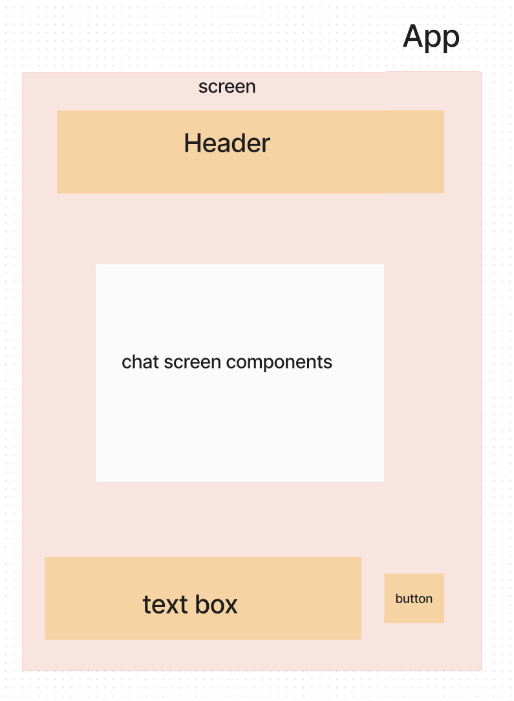

# React Native - Milestone 1: MVP
## LAB - Class 43
### Author: Coriana Williams

### Problem Domain# Phase 1 Requirements
The problem domain of the ChatScreen component is to provide a functional and user-friendly chat interface, allowing users to interact with messages effectively. 

The ChatScreen component is responsible for rendering the chat interface, managing the state of messages, and handling user interactions such as sending and deleting messages. The tests for this component verify that it behaves correctly in various scenarios, ensuring that messages are displayed correctly, new messages are added to the chat list, and deleted messages are removed from the list.

### Links and Resources
- 
- 

## Collaborators
Eva Grace, Kaedon O'Meara, Ethan Store

### Setup
- e.g. `expo start`

#### Tests
- npm test

#### UML
- 